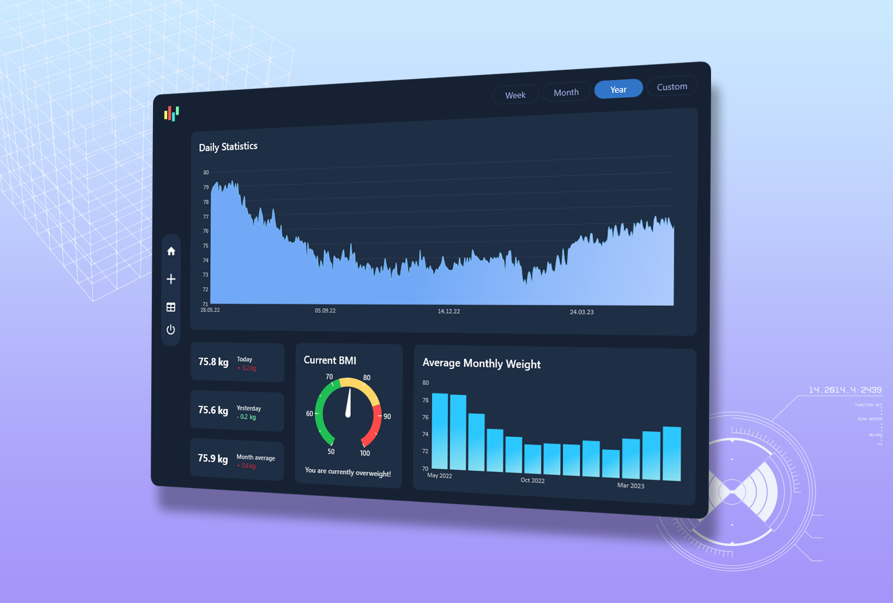

# Weight-Tracker Application

## Description

The Weight-Tracker application is a C# and WPF-based desktop application designed to monitor and manage body weight. It offers visual representations of weight trends, helping users track their progress over time.

## Features

The Weight-Tracker application offers the following features:

1. **Daily Weight Statistics Chart**: Visualizes daily weight statistics using an interactive chart. Users can choose specific date ranges, such as week, month, year, or custom, to explore weight trends.

2. **Info Cards**: Provides essential weight-related information through three info cards:
   - Today's weight and the difference compared to yesterday's weight.
   - Yesterday's weight and the difference compared to the day before yesterday's weight.
   - Average weight for the current month, along with the difference in kilograms from the previous month's average.

3. **Current BMI Chart**: Displays the current weight on a doughnut chart, indicating whether it falls within the normal weight, overweight, or obese weight categories.

4. **Average Monthly Weight Bar Chart**: Shows a bar chart presenting the average weight for the last 12 months. It is planned to add a button to select a custom range of dates for viewing average weight statistics.

5. **Data Source**: The application retrieves weight data from a local MS SQL Database.

6. **Control Menu**: Features a non-traditional control menu with four buttons:
   - Home: Navigates to the main view dashboard.
   - Add New Weight: Allows users to input and save their weight for the current day.
   - Table View: (Not yet implemented and I'm not quite sure whether it is required) Provides a table view of weight data.
   - Close App: Exits the Weight-Tracker application.

7. **Duplicate Data Prevention**: A checking mechanism will be implemented to prevent duplicate weight values in the database, ensuring that data for the current day is added only once.

## Technologies Used

- C# programming language
- Windows Presentation Foundation (WPF) framework
- MS SQL Database
- LiveCharts library (https://v0.lvcharts.com/)
- MahApps icon packs (https://github.com/MahApps/MahApps.Metro.IconPacks)

## Preview

## Authors

- [Alex Litvin](https://github.com/hhlitval)

## License

This project is licensed under the [MIT License](LICENSE).
